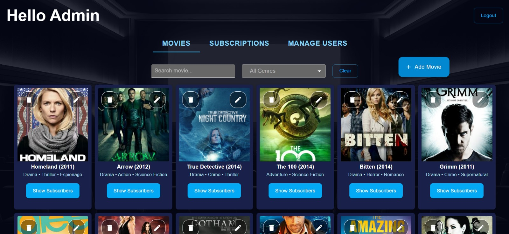
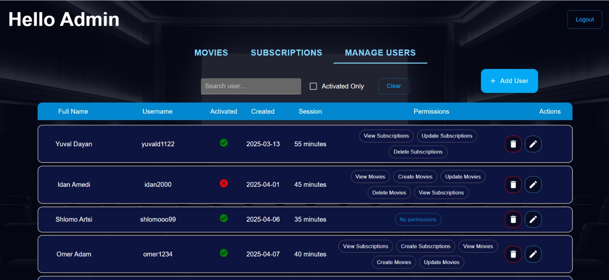

# Movie and Subscription Management System Project

Welcome to the Movie and Subscription Management System project!
This system allows registered users to manage members and subscribe them to movies, utilizing a detailed permission system for access control.

## Technologies Used

* **Frontend:**
    * React
    * Redux (for state management)
    * Material-UI (UI components library)
* **Backend:**
    * Node.js
    * Express (web framework)
    * Mongoose (ODM for MongoDB)
    * REST API (communication architecture)
* **Database:**
    * MongoDB
* **Additional Tools:**
    * bcrypt (password hashing)
    * Axios (HTTP client)
    * Postman (API testing)
    * Studio 3T (MongoDB management)

## Project Description

This system offers a comprehensive platform for managing a movie library and subscriptions. Registered users can perform various actions based on their assigned permissions, including creating, viewing, updating, and deleting movies and subscriptions. The system also includes advanced user management with defined access levels and permissions.

### User Permissions

The system incorporates a robust authentication process to ensure only authorized users or administrators can access specific functionalities. New users created by the administrator must complete an initial registration on the login page to set their password.

The system supports a detailed permission system, including the following permissions:

* `Create Movies`
* `View Movies`
* `Update Movies`
* `Delete Movies`
* `View Subscriptions`
* `Create Subscriptions`
* `Update Subscriptions`
* `Delete Subscriptions`

Users can only access functions and areas within the system according to their granted permissions.

### User Management and Security

* **User Management by Admin:** Only the main system administrator can create new users.
* **User Creation Without Password:** The administrator creates users with basic details but without an initial password.
* **Initial Registration:** New users are required to register and choose a password on the login page for the first time.
* **Secure Login:** Users log in using their username and password.
* **Session Timeout:** After a defined period, users are automatically logged out of the system.
* **Admin User Editing:** The system administrator can edit the details of existing users.

### Backend Architecture

The system's backend is built with a modular design and includes several key components:

* **Combined Database (Members and Movies):** This MongoDB database stores information about members and movies. Some movie and member data is initialized from an external web service. This database also manages member movie subscriptions.
* **Database and Files (Users and Permissions):** User data (username, personal details) is stored in a separate MongoDB database and two JSON files containing additional information about users and their permissions.
* **Main Backend Server:** This Node.js/Express server receives requests from the client (React), aggregates data from the user database, files, and the secondary server (subscriptions server), and returns responses to the client. It is responsible for user management, permissions, and overall integration.
* **Secondary Backend Server (Subscriptions):** This Node.js/Express server operates directly with the combined database (members and movies) and provides information and services related to subscriptions to the main server.

### User Interface (Frontend)

The system's user interface, built using React and Material-UI, focuses on a comfortable and efficient user experience. It includes main tabs for managing:


* **Movies:** Allows (based on permission) viewing, creating, updating, and deleting movies.
    

* **Subscriptions:** Allows (based on permission) viewing, creating, updating, and deleting members and subscriptions for members.
    

* **Users:** (Accessible only to the administrator) Allows managing users, including creation and editing.
    

## Installation and Setup

1.  **Clone the Repository:**
    ```bash
    git clone [https://github.com/giladabudi6/OnlineMovies.git](https://github.com/giladabudi6/OnlineMovies.git)
    cd OnlineMovies
    ```
2.  **Backend Setup (ServerSubscriptions - Port 3000):**
    * Navigate to the server subscriptions directory:
      ```bash
      cd ServerSubscriptions
      ```
    * Install dependencies:
      ```bash
      npm install
      ```
    * Create a `.env` file based on `.env.example` and configure the necessary environment variables, such as the MongoDB URI.
    * Run the server:
      ```bash
      npm run dev        # for development mode with Nodemon (if configured)
      # or
      npm start          # for regular execution
      ```
    * This server will typically run on **http://localhost:3000** (or the port specified in your `.env` file).

3.  **Backend Setup (ServerCinema - Port 4000):**
    * Navigate to the server cinema directory:
      ```bash
      cd ../ServerCinema
      ```
    * Install dependencies:
      ```bash
      npm install
      ```
    * Create a `.env` file based on `.env.example` and configure the necessary environment variables, such as the MongoDB URI and the API URL for the subscriptions server (`http://localhost:3000`).
    * Run the server:
      ```bash
      npm run dev        # for development mode with Nodemon (if configured)
      # or
      npm start          # for regular execution
      ```
    * This server will typically run on **http://localhost:4000** (or the port specified in your `.env` file).

4.  **Frontend Setup (client):**
    * Navigate to the client directory:
      ```bash
      cd ../client
      ```
    * Install dependencies:
      ```bash
      npm install
      ```
    * If the frontend requires environment variables (e.g., the API URL of the cinema server), create a `.env` or `.env.local` file based on `.env.example` and configure them (remembering to prefix React environment variables with `REACT_APP_`).
    * Run the client:
      ```bash
      npm start
      ```
    * The client will typically run on a port automatically assigned by your system (e.g., `http://localhost:3000` if available, otherwise another port). Check your console output for the exact URL.


## API Endpoints (Backend)

The main API endpoints are as follows:

### Members (`/members`)

* `GET /members`: Get a list of all members.
* `GET /members/:id`: Get a member by ID.
* `POST /members`: Add a new member.
* `PUT /members/:id`: Update an existing member.
* `DELETE /members/:id`: Delete a member.
* `GET /members/initializeMembers`: Initialize member data from an external web service and save it to the database.

### Movies (`/movies`)

* `GET /movies`: Get a list of all movies.
* `GET /movies/:id`: Get a movie by ID.
* `POST /movies`: Add a new movie.
* `PUT /movies/:id`: Update an existing movie.
* `DELETE /movies/:id`: Delete a movie.
* `GET /movies/initializeMovies`: Initialize movie data from an external web service and save it to the database.

### Subscriptions (`/subscriptions`)

* `GET /subscriptions`: Get a list of all subscriptions.
* `GET /subscriptions/:id`: Get a subscription by ID.
* `POST /subscriptions`: Add a new subscription.
* `PUT /subscriptions/:id`: Update an existing subscription.
* `DELETE /subscriptions/:id`: Delete a subscription.

### Users (`/users`)

* `GET /users`: Get a list of all users (combines data from various sources).
* `GET /users/:id`: Get a user by ID (combines data from various sources).
* `POST /users`: Add a new user (saves data to both file and database).
* `PUT /users/:id`: Update an existing user (updates data in both file and database).
* `DELETE /users/:id`: Delete a user by ID (deletes data from both sources).
* `POST /users/login`: Authenticate a user and provide a user ID upon successful login.

## Administrator Access

You can access the system with administrator privileges using the following credentials:

* **Username:** `admin`
* **Password:** `12345678`

## License

This project is licensed under the MIT License.
